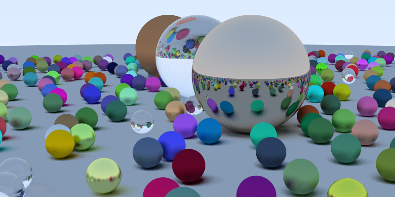

# RayTracing-in-one-week

使用vs2022+opencv实现RayTracing in one week的内容，使用opencv将ppm图片实时渲染。

最终效果图：

参考教程：https://www.bilibili.com/read/cv16795458/?spm_id_from=333.976.0.0
https://zhuanlan.zhihu.com/p/128685960
